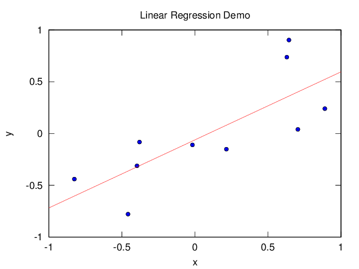
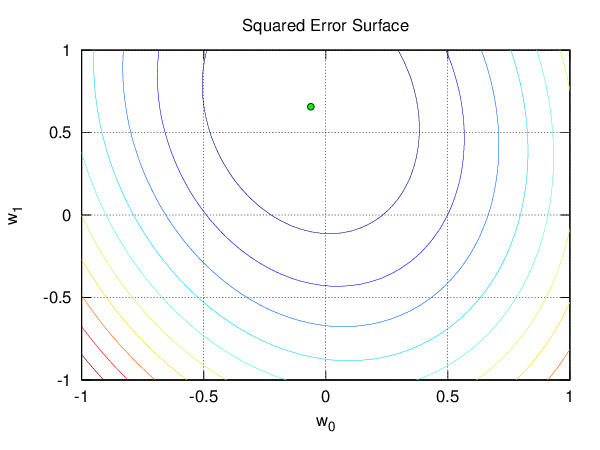
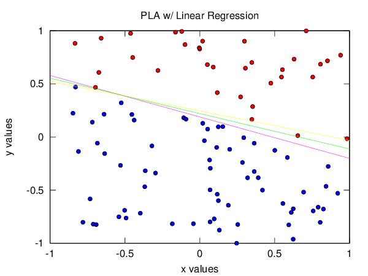
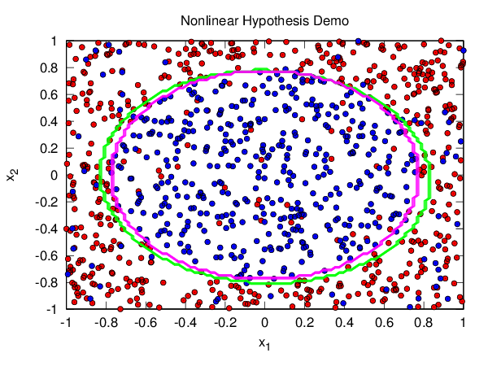

# Code For Week #2

This homework was about the Hoeffding Inequality, noisy target functions and
linear regression with nonlinear transformations.

## Plots

### Linear Regression

To make sure my implementation of linear regression worked, I did a scatter
plot with ![N=10][n10] points uniformly distributed in
![between -1 and 1][interval] along with the regression line, and a contour
plot with the squared error surface with a point marking the optimal ![w][w].

### Linear Regression + Perceptron Learning Algorithm (PLA)

This plot shows the difference between the target function ![f][f] in magenta,
the ![g][g] found via linear regression in yellow, and the ![gd][gd] found via
PLA in green (it uses the weight vector of ![g][g] as the initial weights).

### Linear Regression With Nonlinear Transformation

This plot shows the difference between the noisy target function ![f][target]
in magenta and the hypothesis ![g][g] in green, found via linear regression on
the ![Z][Z] space after applying the transformation ![trans][trans].

[w]: http://latex.codecogs.com/gif.latex?w
[wd]: http://latex.codecogs.com/gif.latex?w%27
[f]: http://latex.codecogs.com/gif.latex?f
[g]: http://latex.codecogs.com/gif.latex?g
[gd]: http://latex.codecogs.com/gif.latex?g%27
[n10]: http://latex.codecogs.com/gif.latex?N%3D10
[interval]: http://latex.codecogs.com/gif.latex?%5B-1%2C1%5D%5Ctimes%5B-1%2C1%5D
[target]: http://latex.codecogs.com/gif.latex?f(x_1%2C%20x_2)%20%3D%20sign(x_1%5E2%20%2B%20x_2%5E2%20-%200.6)
[Z]: http://latex.codecogs.com/gif.latex?Z
[trans]: http://latex.codecogs.com/gif.latex?%5CPhi(x)%20%3D%20(1%2C%20x_1%2C%20x_2%2C%20x_1x_2%2C%20x_1%5E2%2C%20x_2%5E2)
