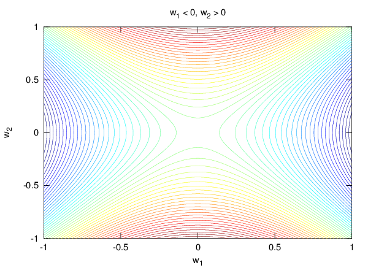
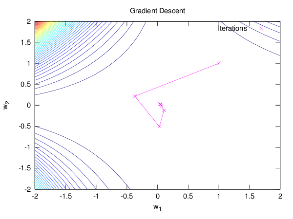

# Week #5

This week's homework was about logistic regression with several flavors of the
gradient descent algorithm (batch, coordinate, stochastic).

## Plots

### Nonlinear Transforms

This first figure shows a particular hyperbolic decision boundary:

### Batch Gradient Descent

This figure shows a proposed nonlinear error surface and the batch gradient
descent steps on that surface, starting on the point ![(u,v)=(1,1)][point]:

[point]: http://latex.codecogs.com/gif.latex?%28w_1%2Cw_2%29%3D%281%2C1%29
